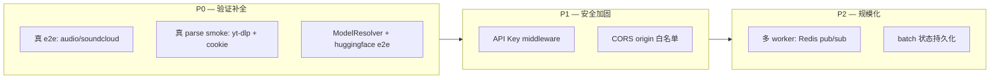

# Roadmap — Multimedia Parsing Service

> 基于当前 "Known limitations" 整理的演进路线。按 **P0 验证补全 → P1 安全加固 → P2 规模化** 三阶段推进。

## 全景图

## P0 — 验证补全（优先级最高）

当前测试覆盖是 "TestClient happy path + cancel（monkeypatch run_parse）"，缺真实站点验证。

| # | 任务 | 内容 | 验收标准 |
|---|---|---|---|
| 1 | 真 parse smoke test | 沙箱/本地跑完整 parse 流程，yt-dlp 需带真实 cookie | `smoke_e2e.py` 全链路绿：parse → fetch → SSE 收到终态 |
| 2 | 真 e2e: audio | soundcloud 公开音频，带 cookie 跑 AudioResolver | audio item 下载成功，`item_id` 格式正确 |
| 3 | ModelResolver 实现 + e2e | 目前是 D2 stub，实现后接 huggingface 下载 | huggingface 模型解析 + 下载成功 |

**依赖关系**: #1 的 cookie 机制是 #2 的前置；#3 相对独立可并行。

## P1 — 安全加固（对外暴露前必须完成）✅ 已完成 (2026-09-04)

当前默认 no-auth + CORS 全放行，仅适合内网信任环境。

| # | 任务 | 内容 | 验收标准 |
|---|---|---|---|
| 4 | ~~API Key middleware~~ ✅ | `API_KEY` env var → 校验 `X-API-Key` header；未设置 env 时保持 no-auth（向后兼容） | 无 key 返回 401；带合法 key 正常；env 未配置时行为不变 |
| 5 | ~~CORS 收紧~~ ✅ | origin 白名单改为配置化（`CORS_ALLOW_ORIGINS` env var，逗号分隔），默认空列表 = 跨域全拒 | 未配置 origin 的跨域请求被拒 |

实现: `multimedia_parsing/security.py` + `server.create_app()`；测试 `tests/test_server_security.py`。

## P2 — 规模化（scaling 时再做）

当前单进程 FastAPI，batch 状态 in-memory，run_parse/run_fetch 用后台线程。

| # | 任务 | 内容 | 验收标准 |
|---|---|---|---|
| 6 | 多 worker 部署 | 事件通道从 per-process `asyncio.Queue` 换 Redis pub/sub；batch 状态共享 | uvicorn 多 worker 下 SSE / cancel / `/batches` 跨 worker 一致 |
| 7 | batch 状态持久化 | batch 状态落 Redis/DB，进程重启不丢 | worker 重启后进行中 batch 可查询/取消 |

## 附注

- **playwright chromium**: 不进默认依赖，属部署步骤（`playwright install chromium`），README 已有说明 — 不单独立项
- **cookie 供给机制**: P0 三项都涉及，做 #1 时顺便定义 `cookie_file` 的标准传法（HTTP body / env / 挂载路径），后续复用
- 任何一项落地后，同步更新 `AGENTS.md` 的 "Known limitations" 段
